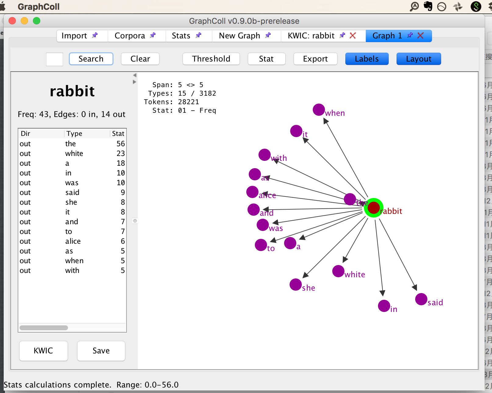
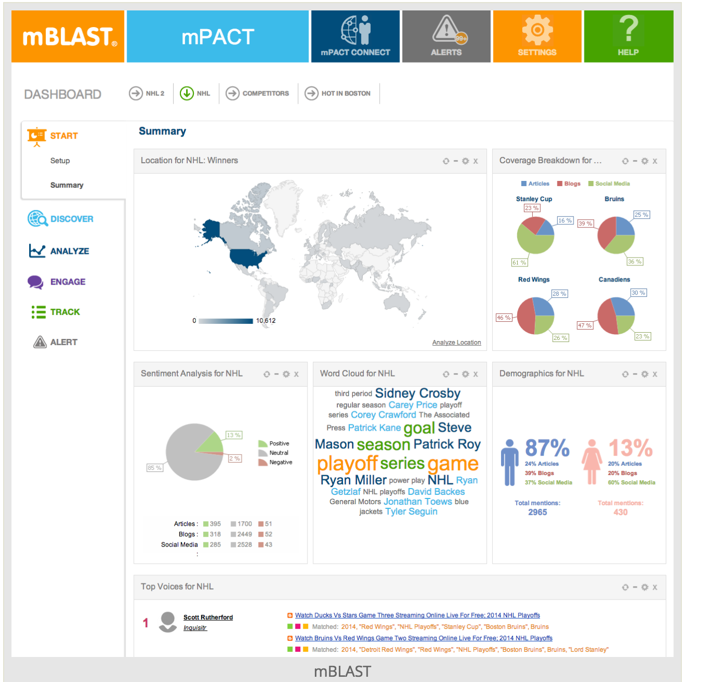
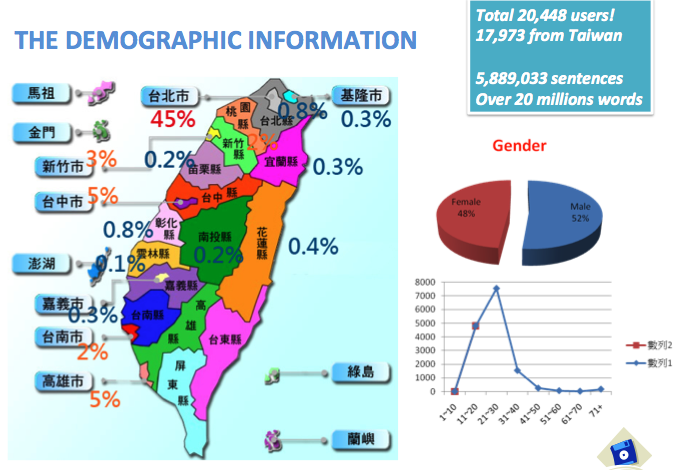
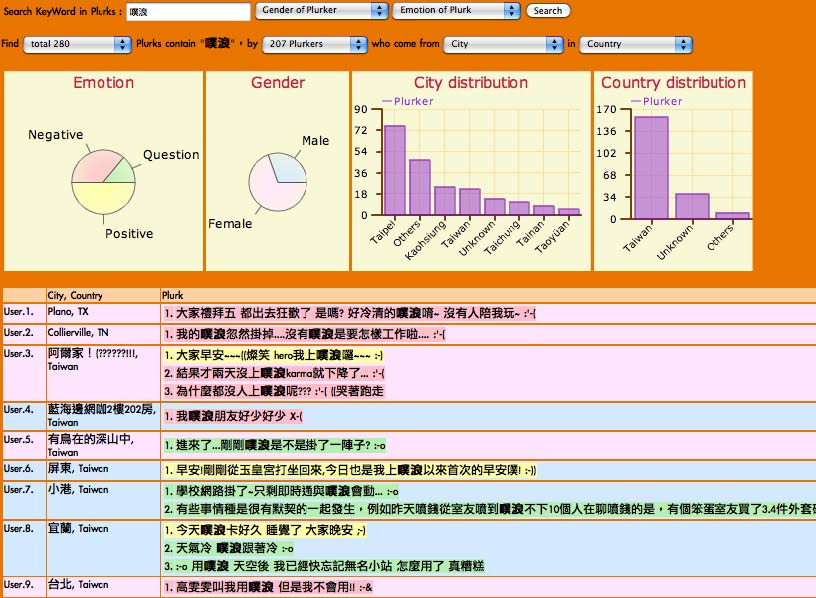
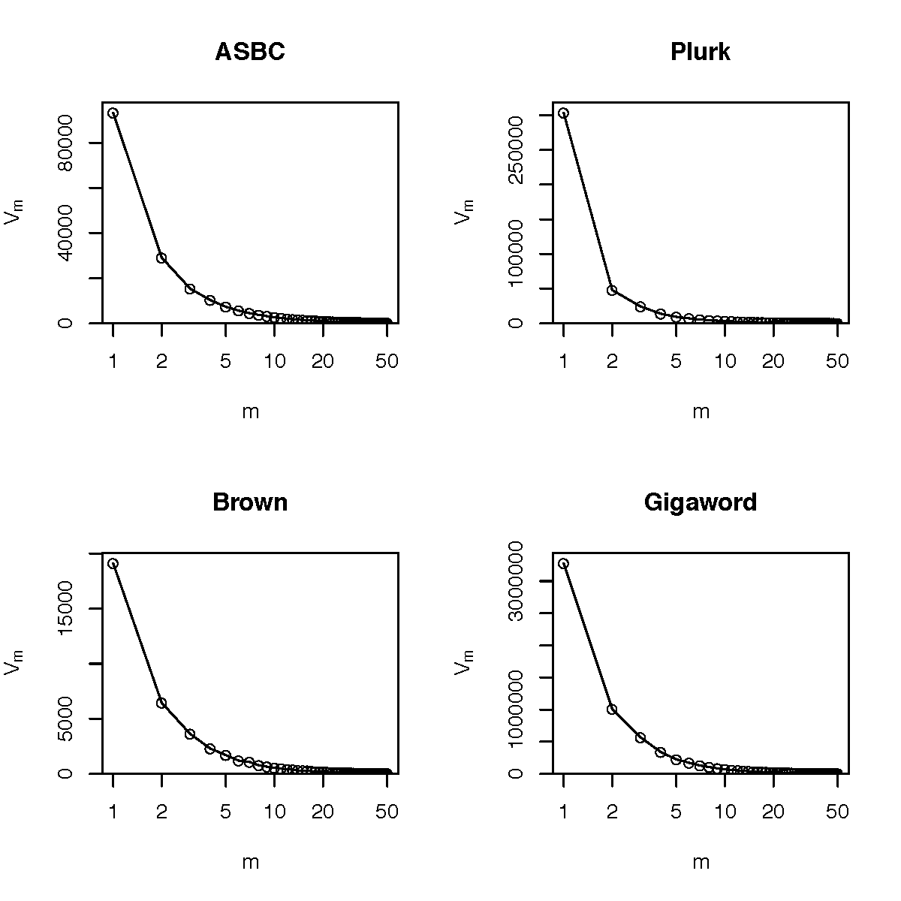
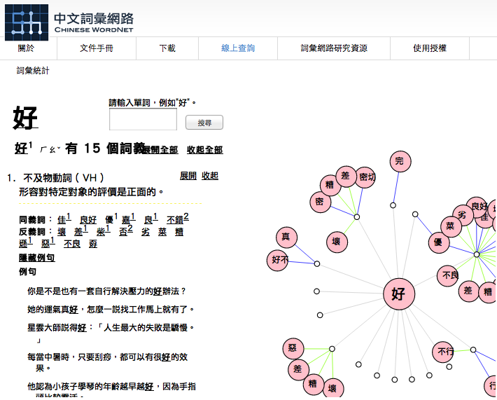
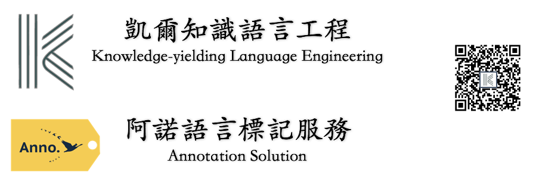

## Outline
<!-- comment -->
1. Background
2. Social Media and Corpus Linguistics
3. Challenges
4. Conclusion

--- bg:#FFFAF0

## Outline
<!--  ========================================================   -->
1. __`Background`__
2. Social Media and Corpus Linguistics
3. Challenges
4. Conclusion

---
## 時代背景

- Sensor, social sensor in the networked age (工業 4.0)

- Revisiting the definition of corpus (Become fully electronic in 1989)

---
## History of Corpus Linguistics 
### 不再有趣的辯論

- Chomskyan linguistics and corpus linguistics: Introspection and intuition vs attested instances of authentic language

- Text archive/Database, Corpus, and the Web (aka. Google as Corpus)

---
## Corpus.Linguistics: Definition

Long-established definition/applications of corpus

> as a collection of authentic (naturally occurring) language, either written or spoken, which has been compiled *for a particular purpose*.(Sinclair 1991, Stubbs 1996, Hunston 2002)

---
## Corpus.Linguistics: 有事嗎

(Candlin and Hall (eds.) 2012)

---
## Corpus.Linguistics: Methodology

- corpus-based, corpus-driven, ...
- appropriate corpus size, representativeness, (genre) balance
   
> The need for a ‘sizeable sample of real-life usage’ to ensure there exists adequate evidence for generating or testing hypotheses about the language.Sampson (2001: 6) 

---
## Corpus.Linguistics: Tools

- 工具不是萬能，沒有工具萬萬不能。

---
## 請放下語言學家的尊嚴
### 手中有了錘子，看什麼都是釘子

---
## Corpus Tools 
### Concordance (是怎麼玩壞語料庫語言學的)

`妳會看幾頁的 google search results`?

---
## Corpus Tools 
### word and ngram frequency

---
## Corpus Tools 
### colligation and collocation (network)
(`GraphColl`, Brezina et. al. 2015)

---
## Corpus tools + Data Science
### Profile, Dashboard, visualization

--- 
## Corpus Tools + Data Visualization
### motion chart for dynamic visualization of language change

<iframe width="560" height="315" src="https://www.youtube.com/embed/6LUjgHPhxRw" frameborder="0" allowfullscreen></iframe>

---
## Corpus Tools + Natural Language Processing
### Corpus Linguistics in a Post-concordancer Era [Wang, 2017].

- it ignores the sentence boundaries in texts and, as a result, the researchers miss the opportunities to automatically analyze the texts at sentence level; 
- the tool also provides little information about the syntactic functions of the words in the corpora, which can be revealed through more recent tools such as Stanford parsers (http://nlp.stanford.edu:8080/parser/) and SyntaxNet. 

---
## Corpus Tools: Summary

- `query`, `extraction`, `statistics`, `visualization`
- **Exploratory Data Analysis** ?

---
## Summary of main limitations
(Candlin and Hall, 2012)

- Corpora can never be fully representative as they are delimited by size
- A corpus presents decontextualised language data divorced from its original context. (Aston 1995; Widdowson 1998)
- due to these technological restrictions, corpus investigations over-emphasise single word forms and collocations at the expense of more discourse-based features of language.

---
## Outline
<!--  ========================================================   -->
1. Background
2. __`Social Media and Corpus Linguistics`__
3. Challenges
4. Conclusion

---
## How social media is changing Language/Corpus linguistics/NLP

- Novelty, Brevity
- Multiword expression (**MWE**), Fragments
- Lexical stabilization

---
## Corpus as Social Sensor in Taiwan: Plurk

---
## Corpus as Social Sensor in Taiwan: Plurk

---
## Corpus as Social Sensor in Taiwan: PTT

http://lopen.linguistics.ntu.edu.tw/pttcorp

---
## PTT dynamic crawler

---
## Outline
<!--  ========================================================   -->
1. Background
2. Social Media and Corpus Linguistics
3. __`Challenges`__
4. Conclusion

---
## Challenges

- Word segmentation (Big data, Big noisy data) 
- Multi-level annotation 
- Social and historical **de-contextualized**

> A corpus presents decontextualised language data divorced from its original context. (Aston 1995; Widdowson 1998)

---
## WaC is in

---
## Why Chinese WaC is Wacky
### Frequency Spectrum (Hsieh, 2013)

---
## Why Chinese WaC is Wacky
### Vocabulary Growth Curve (Hsieh, 2013)

---
## Even Manual check is not that easy

(`plurk_word_list`: 朱學(Na)恆(D))

---
## 更有語言學味道的議題

- Lexical bundles (Hus and Hsieh, 2017)
- 四字格 Quardraic Idiomatic Expresions (QIE). 我不想聽,最好是厚
- Generalized fragments (pattern-grammar alike)

---
## 還沒講到漢語語言變異

http://lopen.linguistics.ntu.edu.tw/diffseg/

---
## Developing Linguistic Annotation for Machine Learning Algorithms
- Now is the Golden Age of Text Analysis

---
## Annotation

### `標記是語言學家的當代逆襲`
  
  - Associating a label (metadata) with specific content in a document.
  - Annotation can be everywhere: 
    - Image labeling
    - Sarcasticm
    -  Event 
  - can probably tackle with `null elements` (Tao, 2017)?

---
## Lopotator 
### 我們需要彈性的工具

---
## 語料庫還能怎樣？本體知識融入

---
## 語料庫還能怎樣？常識規整

<iframe width="520" height="415" src="assets/widgets/nn.html" frameborder="0" allowfullscreen></iframe>
  

---
## 社會性與歷史性
- social network and lexical network (and brain network)
- diachronic word embeddings and thesarus

---
## 從言談的舞蹈與音樂性到情緒分析

> How can we know the dancer from the dance” (William Butler Yeats)

- verbal mimicking

---
## From Corpus to Knowledge
- Korpus: Knowledge-yielding corpus
  - Combining paradigmatic resources (WordNet)
  - lexico-grammatical pattern acquisition

---
## Diachronic character/word embeddings
  
<iframe width="800" height="515" src="http://140.112.147.121:8288" frameborder="0" allowfullscreen></iframe>
  

---
## Outline
1. Background
2. Social Media and Corpus Linguistics
3. Challenges
4. __`Conclusion`__

---
## My two cents

> This is a good time to become a corpus linguist.

- Reinventing education of linguistics
- Corpus as Social Sensor 
- 大智移雲時代脈絡下的語料庫創新

---
## Chatbot 終將一統江湖？

  

---
# Thank you

---
## Reference
[1] J. Pannebaker. 2011. The secret life of pronouns: what our words say about us. Bloomsbury Press.

[2] Candlin and Hall (eds.) 2012. Corpora and language education. Lynne Flowerdew.

[3] Wang S.H. (2017) Text Analysis of Corpus Linguistics in a Post-concordancer Era. In: Wu TT., Gennari R., Huang YM., Xie H., Cao Y. (eds) Emerging Technologies for Education. SETE 2016. Lecture Notes in Computer Science, vol 10108. Springer. 
