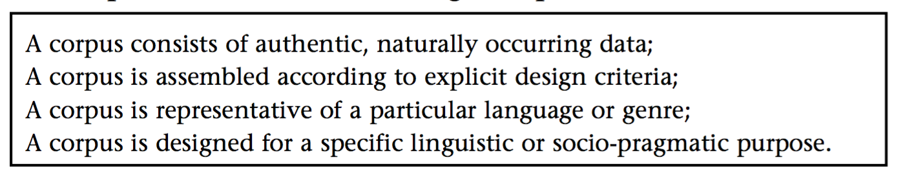
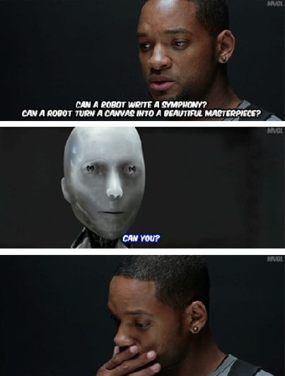
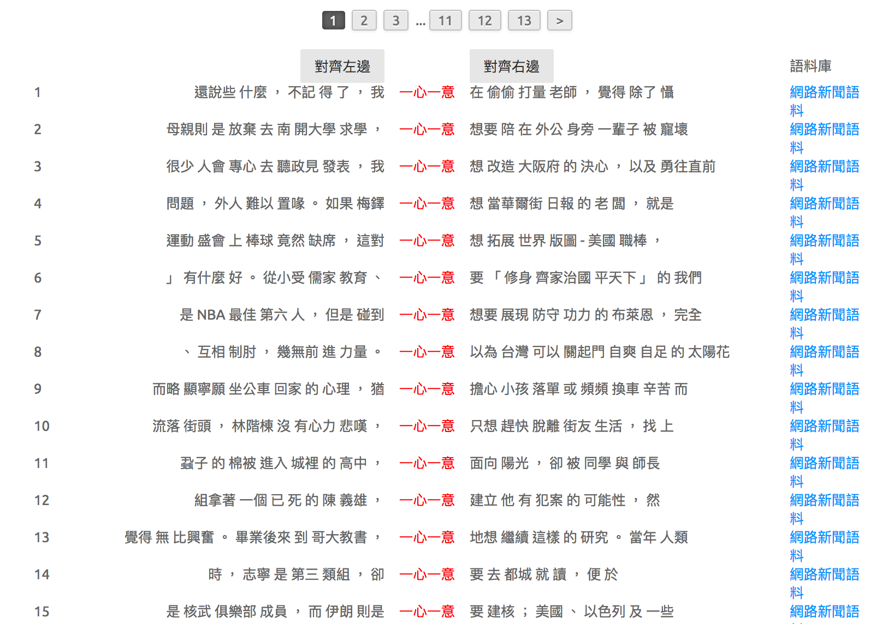
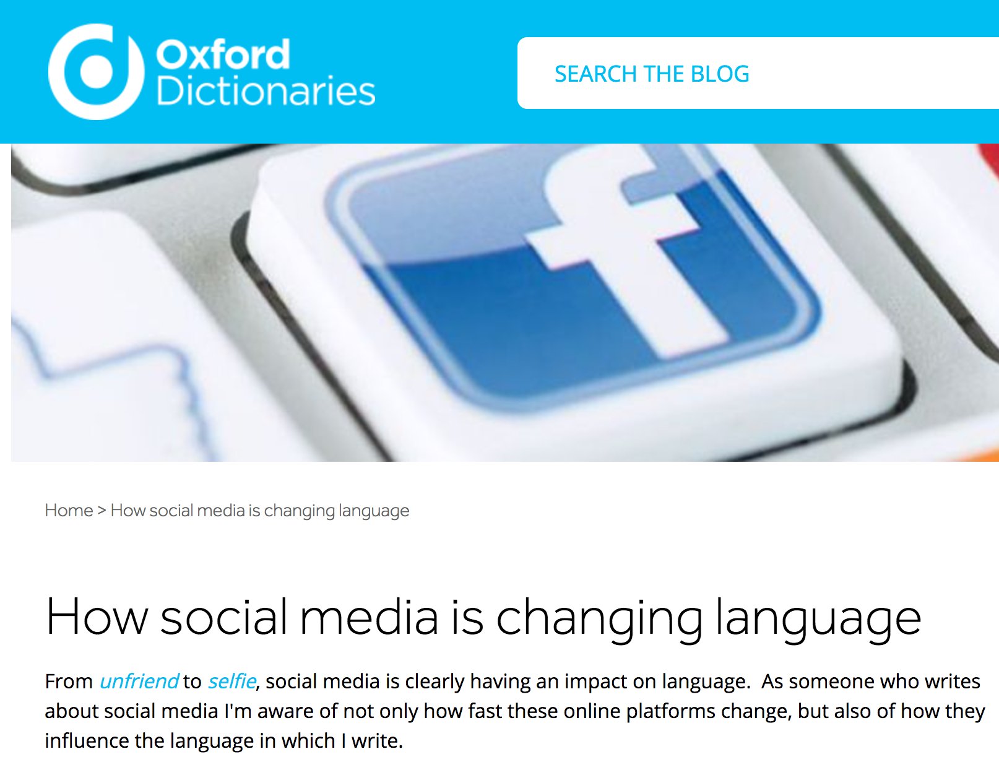
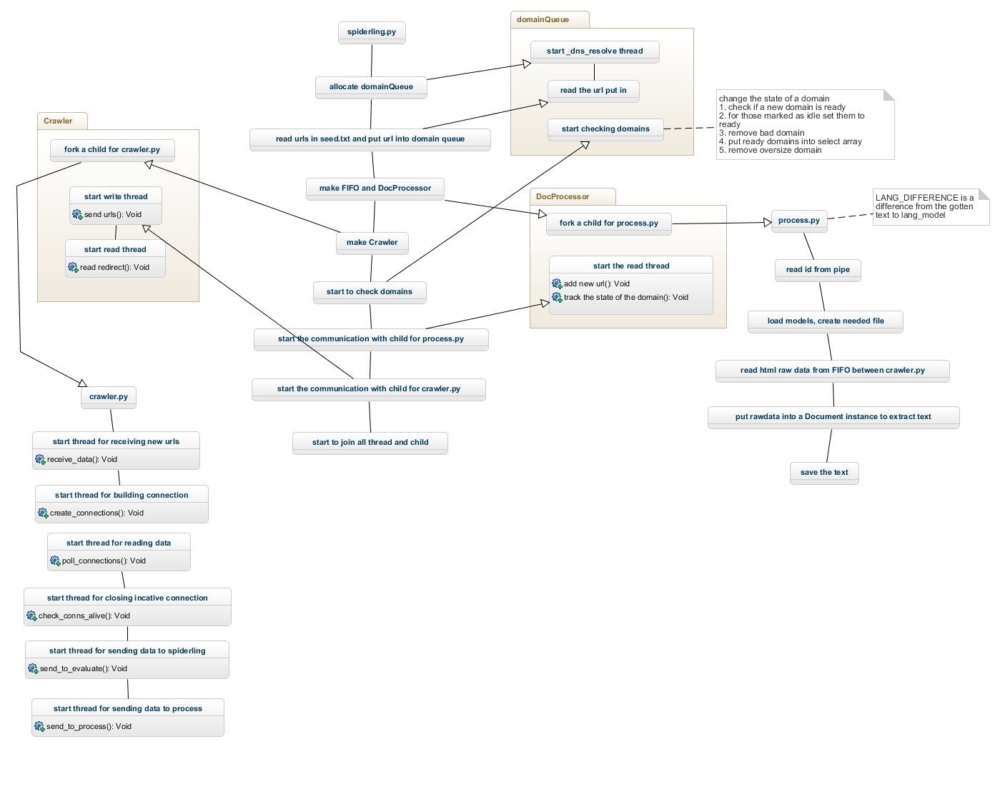
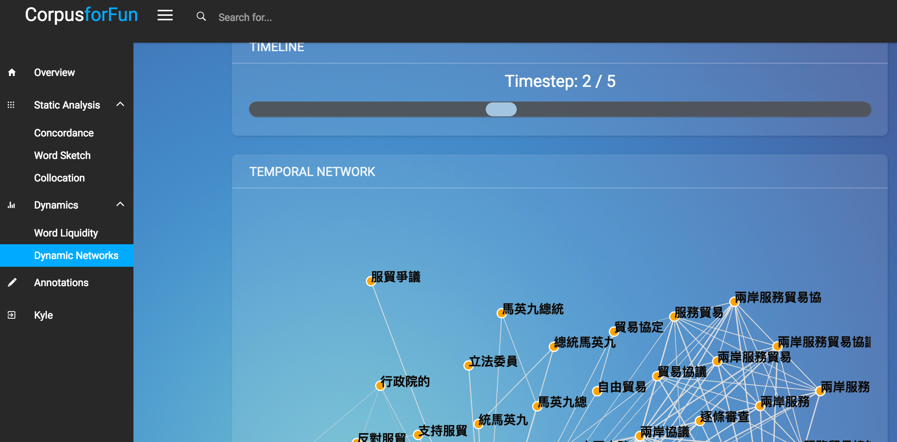

## Outline
<!-- comment -->
1. Introduction
2. Lexicology with the BIG DATA
3. Measuring Lexical Aging as an Example
4. Conclusion


--- bg:#FFFAF0

## Outline
<!--  ========================================================   -->
1. __`Introduction`__
2. Lexicology with the BIG DATA
3. Measuring Lexical Aging as an Example
4. Conclusion


---
## 時代背景

sensor, social sensor in the networked age

- Revisiting the definition of corpus (Become fully electronic in 1989)


---
## History of Corpus Linguistics 不再有趣的辯論

- Chomskyan linguistics and corpus linguistics: Introspection and intuition vs attested instances of authentic language


- Text archive/Database, Corpus, and the Web (aka. Google as Corpus)


---
## Corpus.Linguistics

Long-established definition/applications of corpus

> as a collection of authentic (naturally occurring) language, either written or spoken, which has been compiled *for a particular purpose*.(Sinclair 1991, Stubbs 1996, Hunston 2002)

---
## Corpus.Linguistics: 有事嗎


(Candlin and Hall (eds.) 2012)


---
## Corpus.Linguistics: Methodology

- corpus-based, corpus-driven, ...
- appropriate corpus size, representativeness, (genre) balance
  - Brown corpus 220,000; BYC
  - (Biber 1990): 
   
> Sinclair (1991, 2004a) emphasises that a corpus should be large and that it ‘typically contains many millions of words’ such that the more likely it is to give an adequate representation of the language and suf- ficiently multiple occurrences of the items under investigation. In a similar vein, Sampson (2001: 6) states the need for a ‘sizeable sample of real-life usage’ to ensure there exists adequate evidence for generating or testing hypotheses about the language.


---
## 語料庫怎麼被使用的 (II) 具面
### Raw corpus with naive annotation

- 工具不是萬能，沒有工具萬萬不能。


---
## 請放下語言學家的尊嚴





---
## Corpus Tools 
### Concordance



---
## Corpus Tools 
### word and ngram frequency


---
## Corpus Tools 
### colligation and collocation (network)
(`GraphColl`, Brezina et. al. 2015)


---
## Corpus tools + Data Science
### Profile, Dashboard, visualization


--- &interactive
## Corpus Tools Visualization
### motion chart for dynamic visualization of language change


```r
#require(googleVis)
#load("~/academic_activities/talks and tutorials/2013/ntnu/mot/mot.RData")
#head(convdata)
#head(compdata)
#Modal <- gvisMotionChart(convdata, idvar="VERB", timeva="DECADE") 
#print(Modal, tag ='chart')
#gvisMotionChart(Modal) 

#M1 <- gvisMotionChart(Fruits, idvar="Fruit", timevar="Year")
#plot(M1)
```


---
## Corpus Tools + Natural Language Processing

Corpus Linguistics in a Post-concordancer Era [Wang, 2017].

- it ignores the sentence boundaries in texts and, as a result, the researchers miss the opportunities to automatically analyze the texts at sentence level; 
- the tool also provides little information about the syntactic functions of the words in the corpora, which can be revealed through more recent tools such as Stanford parsers (http://nlp.stanford.edu:8080/parser/) and SyntaxNet. 


---
## Summary of main limitations
(Candlin and Hall, 2012)

- Corpora can never be fully representative as they are delimited by size
- A corpus presents decontextualised language data divorced from its original context. (Aston 1995; Widdowson 1998)
- due to these technological restrictions, corpus investigations over-emphasise single word forms and collocations at the expense of more discourse-based features of language.


Stubbs illustrates how inter-collocations of the verbs ACCOST and LURK examined in the Cobuild corpus build up a network showing common ways of talking about threats to public safety, especially in the mass media (p. 205): Accosted – in the street – by a stranger – lurk beneath the surface – hidden beneath the surface – danger – warning


---
## How social media is changing Language/Corpus linguistics/NLP

- fragment > MWE
- streaming big > seg myth / gobal statistics illusion




---
## PTT corpus as Social Sensor in Taiwan


---
## PTT 




---
## Challenges

Sentiment and self expression

- comp.seg
- annotation/anno.lopotator/markus
- social and historical **de-contextualized**
  
  > A corpus presents decontextualised language data divorced from its original context. (Aston 1995; Widdowson 1998)

---
## Chinese Word Segmentation and Big (noisy) Data


---
## Plurk rare words


---
## Wacky Wacky WaA


---
## CWS.PIPE AND MWE

lexical bundles (Mike's paper.accepted)
QIEs
fragments


---
## CompSeg


http://lopen.linguistics.ntu.edu.tw/diffseg/

---
## Developing Linguistic Annotation for Machine Learning Algorithms
- Now is the Golden Age of Text Analysis


---
## Annotation


---
## anno.solution

- Associating a label (metadata) with specific content in a document.
- Annotation can be everywhere: 
  - Image labeling
  - Sarcasticm
  - Event 


---
## Annotation
- annotated corpus needs to be consistent to 
  - train/test an algorithm
  - gain solid insights 


---
## Lopotator


---
## NLP.TEXT ANALYTICS


---
## Depression detection in texts


---
## 語料庫還能怎樣？


---
## 社會性與歷史性
- social network and lexical network
- diachronic word embeddings


---
## 社會
### 言談的舞蹈與音樂性

> How can we know the dancer from the dance” (William Butler Yeats)

verbal mimicking


---
## From Corpus to Knowledge
- Korpus: Knowledge-yielding corpus
  - Combining paradigmatic resources (WordNet)
  - lexico-grammatical pattern acquisition




---
## 語意網路與語意距離
Lexical Network and Brain Network

<iframe width="520" height="415" src="assets/widgets/nn.html" frameborder="0" allowfullscreen></iframe>
  
  
---
## 自我表達的歷時語意距離計算模擬（神經網路）
  
<iframe width="800" height="515" src="http://140.112.147.121:8288" frameborder="0" allowfullscreen></iframe>
  
  


---
## 實驗：刺激材料
  

  
  

```
## Warning in file(file, "rt", encoding = fileEncoding): 無法開啟檔案
## 'merged.comp.csv' ：No such file or directory
```

```
## Error in file(file, "rt", encoding = fileEncoding): 無法開啟連結
```

```
## Warning in file(file, "rt", encoding = fileEncoding): 無法開啟檔案
## 'merged.freq.csv' ：No such file or directory
```

```
## Error in file(file, "rt", encoding = fileEncoding): 無法開啟連結
```

```
## Error in eval(expr, envir, enclos): 沒有這個函數 "tbl_df"
```

```
## Error in eval(expr, envir, enclos): 找不到物件 'mcomp.tbl'
```

```
## Error in eval(expr, envir, enclos): 沒有這個函數 "tbl_df"
```

```
## Error in eval(expr, envir, enclos): 找不到物件 'mfreq.tbl'
```

```
## Error in apply(mcomp[3:ncol(mcomp)], 1, mean): 找不到物件 'mcomp'
```

```
## Error in apply(mcomp[3:ncol(mcomp)], 1, sd): 找不到物件 'mcomp'
```

```
## Error in apply(mfreq[3:ncol(mfreq)], 1, mean): 找不到物件 'mfreq'
```

```
## Error in apply(mfreq[3:ncol(mfreq)], 1, sd): 找不到物件 'mfreq'
```

```
## Error in eval(expr, envir, enclos): 沒有這個函數 "select"
```

```
## Error in eval(expr, envir, enclos): 沒有這個函數 "select"
```

```
## Error in eval(expr, envir, enclos): 沒有這個函數 "full_join"
```

```
## Error in eval(expr, envir, enclos): 沒有這個函數 "%>%"
```


---
## 實驗：Questionnaire 
  

  
  
---
## 實驗：Ratings analysis
  
<iframe width="520" height="415" src="assets/widgets/wp.html" frameborder="0" allowfullscreen></iframe>
  
  
  
  
--- 
## 實驗：Ratings analysis (diverging stacked bar charts) 
  
  


  

---
## Conclusion

> This is a good time to become a corpus linguist.

- Corpus as Social Sensor 
- 大智移雲時代脈絡下的語料庫創新


---
## Chatbot 終將一統江湖？


  


---
# Thank you


---
## Reference
[1] J. Pannebaker. 2011. The secret life of pronouns: what our words say about us. Bloomsbury Press.
[2] Candlin and Hall (eds.) 2012. Corpora and language education. Lynne Flowerdew.
[3] Wang S.H. (2017) Text Analysis of Corpus Linguistics in a Post-concordancer Era. In: Wu TT., Gennari R., Huang YM., Xie H., Cao Y. (eds) Emerging Technologies for Education. SETE 2016. Lecture Notes in Computer Science, vol 10108. Springer. 
